<div align="center">

### <code>ayush@github ~ $ ./contributions.sh</code>



<br><br>

### <code>ayush@github ~ $ whoami</code>

<table>
  <tr>
    <td valign="top" align="center">
      
    </td>
    <td valign="top" align="center">
      
    </td>
  </tr>
</table>

<br>

```bash
# Connect & Collaborate
🌐 Portfolio: https://gryven.vercel.app
📧 Email:     ayushnautiyal9520@gmail.com
💻 GitHub:    https://github.com/ayushnautiyal9520-create
```

</div>
